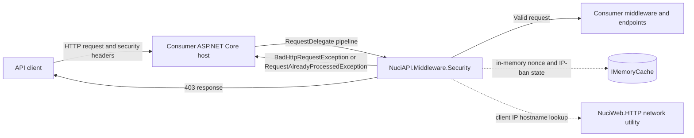
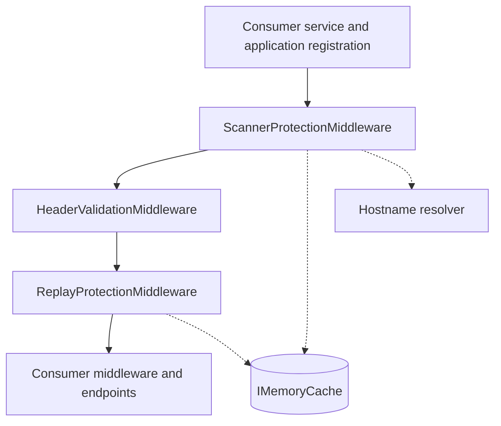
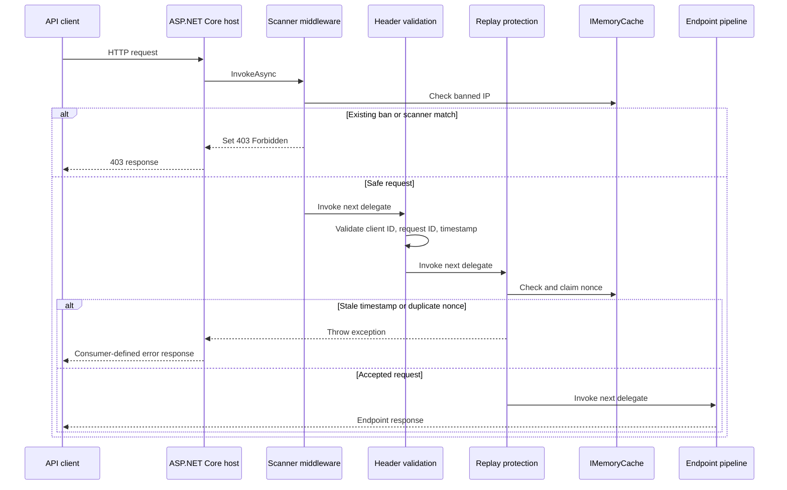
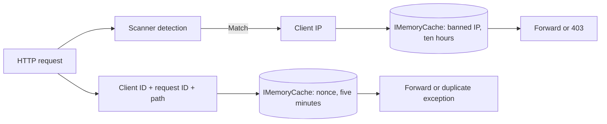
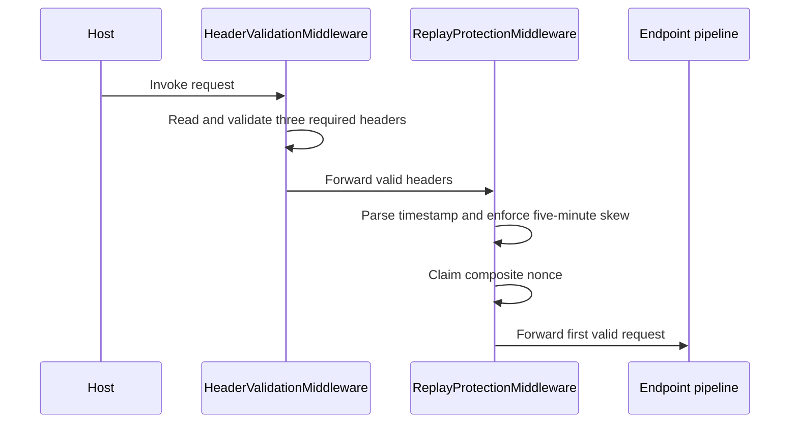
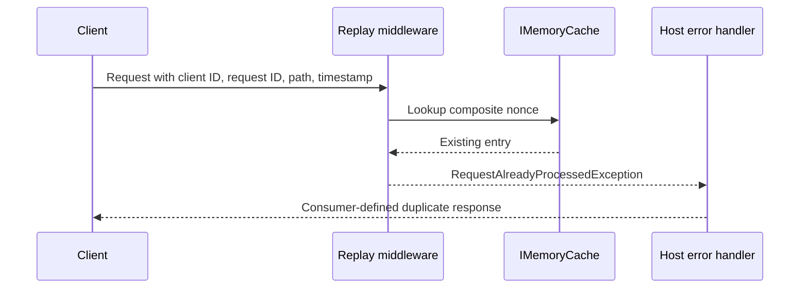
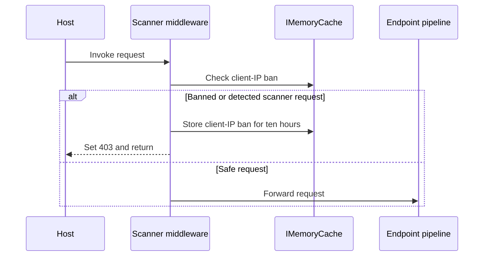
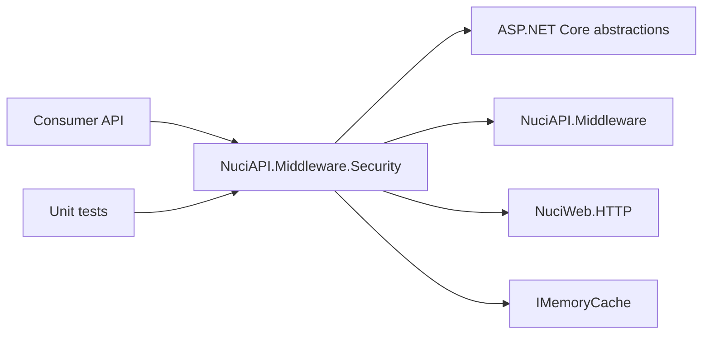

# NuciAPI.Middleware.Security Architecture

This document describes the current architecture of the `NuciAPI.Middleware.Security` ASP.NET Core middleware library, its request-processing contracts, in-memory state, composition boundary, and verification surface. It does not describe a hosted API or a proposed target architecture.

## 📑 Table of Contents

- [Purpose](#purpose)
- [System Context](#system-context)
- [Architectural Style](#architectural-style)
- [Runtime Flow](#runtime-flow)
- [Components](#components)
- [Architectural Areas](#architectural-areas)
  - [Security Middleware Library](#security-middleware-library)
  - [Unit Test Project](#unit-test-project)
- [Data Architecture](#data-architecture)
- [Interfaces and Integrations](#interfaces-and-integrations)
- [Key Flows](#key-flows)
  - [Validated Request](#validated-request)
  - [Replay Rejection](#replay-rejection)
  - [Scanner Blocking](#scanner-blocking)
- [Domain-Specific Security Policies](#domain-specific-security-policies)
- [Cross-Cutting Concerns](#cross-cutting-concerns)
  - [Security and Privacy](#security-and-privacy)
  - [Error Handling](#error-handling)
  - [Configuration](#configuration)
  - [Concurrency and Resource Use](#concurrency-and-resource-use)
- [Dependency Direction and Rules](#dependency-direction-and-rules)
- [External Dependencies](#external-dependencies)
- [Deployment and Operations](#deployment-and-operations)
- [Compatibility Contracts](#compatibility-contracts)
- [Testing and Verification](#testing-and-verification)
- [Design Constraints](#design-constraints)
- [Extension Points](#extension-points)
- [Source Map](#source-map)
- [Related Documentation](#related-documentation)

## 🎯 Purpose

This package supplies opt-in request protections for ASP.NET Core APIs: required-header validation, short-window replay detection, and scanner or bot blocking with temporary IP bans. The architecture boundary is the reusable middleware library and its registration extensions; the consuming API owns hosting, middleware order, exception translation, proxy configuration, and endpoint execution. This document is intended for contributors and consumers evaluating request ordering, state ownership, security consequences, and change impact.

## 🌐 System Context

The package executes inside a consumer-owned ASP.NET Core request pipeline. An API client sends HTTP requests to the host application. The host invokes the registered security middleware, which either assigns `403 Forbidden`, throws a validation or replay exception, or forwards the request to subsequent middleware and endpoint logic. The package has no database, file store, network client, or independent process.



The principal external boundaries are:
- **Consumer ASP.NET Core host:** Owns process startup, dependency injection, middleware order, exception handling, endpoint execution, response policy, and proxy forwarding configuration.
- **API client:** Supplies the client identifier, uppercase request identifier, timestamp, HTTP path, query, headers, method, and optional body examined by the middleware.
- **`IMemoryCache`:** Stores replay keys for five minutes and banned IP keys for ten hours in the host process.
- **Client IP and hostname environment:** Supplies the request client address and the default hostname resolver used by scanner protection; its correctness depends on the host's proxy configuration.

## 🏗️ Architectural Style

The package is an ASP.NET Core middleware pipeline library with explicit extension-method composition and stateless policy components backed by process-local cache state. Each middleware owns one protection concern and delegates accepted requests to the next `RequestDelegate`. The principal consequence is that consumers can enable protections independently, but they must configure registration and ordering correctly and must provide the cross-request cache lifetime.



The principal architecture boundaries are:
- **Composition facade:** `NuciApiMiddlewareSecurityExtensions` exposes service registration and application-pipeline insertion without owning host startup.
- **Scanner boundary:** Rejects recognised probing patterns and records temporary IP bans before forwarding safe requests.
- **Header boundary:** Validates required identifiers and timestamp syntax before forwarding requests.
- **Replay boundary:** Validates timestamp freshness and claims a composite nonce in the injected cache before forwarding requests.
- **Consumer boundary:** Owns exception mapping, endpoint behaviour, proxy trust, cache topology, and operational deployment.

## 🔄 Runtime Flow



The principal runtime sequence is:
1. The consumer host invokes the configured security middleware for each request.
2. Scanner protection checks an existing IP ban and then normalises and evaluates path, query, selected headers, root-request shape, and resolved hostnames.
3. Header validation reads the required NuciAPI headers and rejects missing or malformed values.
4. Replay protection parses the timestamp, enforces a plus-or-minus five-minute window, and claims `client ID + request ID + request path` in `IMemoryCache`.
5. Accepted requests reach the consumer pipeline; blocked requests receive `403`, while validation and replay failures propagate as exceptions to the consumer's error handler.

## 🧩 Components

| Component | Responsibility | Principal Dependencies | Lifetime or Ownership |
|-----------|----------------|------------------------|-----------------------|
| `NuciApiMiddlewareSecurityExtensions` | Registers cache services and inserts middleware into an `IApplicationBuilder` pipeline. | ASP.NET Core dependency injection and application builder | Static facade; consumer owns invocation and ordering |
| `ScannerProtectionMiddleware` | Detects scanner signatures, blocks requests, and stores temporary IP bans. | `RequestDelegate`, `IMemoryCache`, hostname resolver, ASP.NET Core request context | One middleware instance in the host pipeline; cache state is process-local |
| `HeaderValidationMiddleware` | Validates client ID, uppercase GUID request ID, and timestamp syntax. | `RequestDelegate`, NuciAPI middleware header helpers | One middleware instance in the host pipeline; no owned persistent state |
| `ReplayProtectionMiddleware` | Enforces timestamp freshness and duplicate-request protection. | `RequestDelegate`, `IMemoryCache`, NuciAPI header helpers | One middleware instance in the host pipeline; nonce state is cache-owned |
| `RequestAlreadyProcessedException` | Represents a duplicate composite nonce. | Base `Exception` | Created per rejected request; consumer owns translation |
| `NuciAPI.Middleware.Security.UnitTests` | Verifies policy decisions, delegation, constructor guards, cache behaviour, and exception contracts. | NUnit, Moq, ASP.NET Core abstractions, project reference | Test-only project |

## 🗂️ Architectural Areas

### Security Middleware Library

Paths:
- [NuciAPI.Middleware.Security](NuciAPI.Middleware.Security)
- [NuciAPI.Middleware.Security.csproj](NuciAPI.Middleware.Security/NuciAPI.Middleware.Security.csproj)

Responsibilities:
- Expose the public registration and pipeline-insertion facade.
- Apply independent request validation, replay, and scanner policies.
- Keep temporary state in the injected process-local memory cache.

Boundary rules:
- Middleware forwards only requests that satisfy its own policy.
- The library does not map exceptions, create responses for exception cases, or execute endpoints.
- The library must retain the public extension-method and exception contracts used by consuming APIs.

### Unit Test Project

Paths:
- [NuciAPI.Middleware.Security.UnitTests](NuciAPI.Middleware.Security.UnitTests)
- [NuciAPI.Middleware.Security.UnitTests.csproj](NuciAPI.Middleware.Security.UnitTests/NuciAPI.Middleware.Security.UnitTests.csproj)

Responsibilities:
- Exercise each middleware through `HttpContext` and `RequestDelegate` boundaries.
- Verify cache-backed replay and IP-ban state, including safe and blocked branches.
- Verify public exception message and constructor argument guards.

Boundary rules:
- Tests reference the library project and do not introduce runtime dependencies into the package.
- Test doubles may replace hostname resolution to isolate scanner policy decisions.

## 💾 Data Architecture

The package owns two transient key-value categories in `IMemoryCache`. It does not persist request data beyond cache expiry and does not define a distributed-cache adapter. Replay entries are created after timestamp validation and expire after five minutes. Scanner bans are created after a detected pattern and expire after ten hours. Cache keys include client-controlled identifiers or IP addresses, so host operators must treat cache contents as security-sensitive operational state.



| Data or Store | Owner | Representation and Storage | Lifecycle or Consistency |
|---------------|-------|----------------------------|--------------------------|
| Replay nonce | `ReplayProtectionMiddleware` | Boolean value under `nonce:{clientId}:{requestId}:{path}` in `IMemoryCache` | Created on first accepted nonce; absolute expiry is five minutes; local to one process |
| Scanner IP ban | `ScannerProtectionMiddleware` | Boolean value under `nuciapi.middleware.banned-ip:{ip}` in `IMemoryCache` | Created on a scanner match; expires after ten hours; local to one process |
| Request security inputs | Consumer request pipeline | Headers, method, path, query, body, and client IP in `HttpContext` | Read during one request; the scanner temporarily buffers and restores the body for root-request inspection |

## 🔌 Interfaces and Integrations

| Interface or Integration | Direction | Contract | Owner | Failure Semantics |
|--------------------------|-----------|----------|-------|-------------------|
| `AddNuciApiScannerProtection` | Inbound registration | Adds `IMemoryCache` to consumer services | Extension facade and consumer composition root | Registration returns the service collection; host owns service-provider failures |
| `AddNuciApiReplayProtection` | Inbound registration | Adds `IMemoryCache` to consumer services | Extension facade and consumer composition root | Registration returns the service collection; host owns service-provider failures |
| `UseNuciApiScannerProtection` | Inbound pipeline | Inserts `ScannerProtectionMiddleware` | Extension facade and consumer pipeline | Scanner matches set `403`; constructor or dependency failures surface during host composition |
| `UseNuciApiHeaderValidation` | Inbound pipeline | Inserts `HeaderValidationMiddleware` | Extension facade and consumer pipeline | Missing or malformed required headers throw `BadHttpRequestException` |
| `UseNuciApiReplayProtection` | Inbound pipeline | Inserts `ReplayProtectionMiddleware` | Extension facade and consumer pipeline | Stale timestamps throw `BadHttpRequestException`; duplicate keys throw `RequestAlreadyProcessedException` |
| `IMemoryCache` | Bidirectional state integration | Boolean transient entries with fixed absolute expiries | Consumer DI container and individual middleware | Absence permits processing; eviction or process restart removes protection state |
| Hostname resolver | Outbound lookup from scanner policy | `Func<string, List<string>>`, defaulting to `NetworkUtils.GetHostnames` | Scanner middleware; injectable in tests | Empty results do not block; resolver failure is not translated by the package |
| Consumer exception handler | Outbound from middleware to host | Maps package exceptions to the API's response contract | Consumer application | The package does not prescribe status mapping; README recommends `400` and typically `409` |

## 🔀 Key Flows

### Validated Request



Header validation requires a client identifier longer than three characters, an uppercase textual GUID request identifier, and a parseable `DateTimeOffset`. Replay protection assumes the same headers are present, rejects timestamps beyond the five-minute absolute difference, and claims the composite key before endpoint execution. The documented consumer order is scanner, header validation, then replay protection.

### Replay Rejection



A nonce is scoped by client ID, request ID, and path. The same request ID may therefore be accepted for a different client ID or path. The cache entry is claimed before the downstream delegate is invoked, so a downstream failure does not remove the nonce and a retry is still treated as a duplicate until expiry.

### Scanner Blocking



Scanner detection URL-decodes paths and queries, applies resource and query regular expressions, examines selected `From`, `User-Agent`, and `sec-ch-ua` values, applies special rules to root requests, and checks hostnames resolved from the client IP. A match bans a non-empty client IP and stops the pipeline. Requests without a usable IP are still blocked for the current match but cannot create a reusable IP ban.

## ⚙️ Domain-Specific Security Policies

The scanner policy is a deny-list of known probing patterns rather than a general behavioural analysis system. It includes requests for common configuration, credential, source-control, debugging, cloud metadata, framework, and backup resources; suspicious query forms; selected automated-client signatures; and hostnames associated with scanner or Tor exit infrastructure. Matching is case-insensitive and regular expressions have a one-second execution timeout. The policy is encoded in the middleware and expanded through source changes and tests.

## 🧵 Cross-Cutting Concerns

### Security and Privacy

The trust boundary is the incoming HTTP request: all headers, path, query, body, and client-IP information are untrusted. Header validation checks required format, replay protection checks temporal freshness and uniqueness, and scanner protection rejects recognised probing indicators before endpoint execution. Client IP extraction depends on the host's trusted proxy configuration; this package does not establish that trust. The package does not log or persist request contents, but cache keys contain client identifiers, paths, and IP addresses and should be treated as sensitive in diagnostics.

### Error Handling

`BadHttpRequestException` represents invalid required headers and timestamps, while `RequestAlreadyProcessedException` represents a duplicate nonce. These exceptions propagate through the consumer pipeline and require host-owned exception handling to become an API response. Scanner matches are handled locally by setting `403 Forbidden` and returning without invoking the next delegate. Cache and hostname-resolver failures are not retried or translated by this library.

### Configuration

| Configuration Area | Source | Responsibility | Override or Secret Policy |
|--------------------|--------|----------------|---------------------------|
| Enabled protections | Consumer `IServiceCollection` and `IApplicationBuilder` calls | Selects which cache registration and middleware components participate | No package configuration file or environment override is defined |
| Middleware order | Consumer application pipeline | Establishes scanner, header, replay, and endpoint ordering | Consumer-controlled; recommended order is scanner, header validation, replay |
| Replay window | Compiled policy in `ReplayProtectionMiddleware` | Accepts timestamps within five minutes and expires nonces after five minutes | Requires source change; no runtime setting exists |
| IP-ban duration and signatures | Compiled policy in `ScannerProtectionMiddleware` | Controls ten-hour bans and deny-list matching | Requires source change; no secret values are defined |
| Client IP forwarding | Consumer host and reverse-proxy configuration | Determines the address used for scanner bans and hostname lookup | Must be configured by the host; the package does not validate proxy trust |

### Concurrency and Resource Use

ASP.NET Core may invoke middleware concurrently for many requests. `IMemoryCache` supplies the shared process-local state, while the middleware instances do not maintain mutable per-request fields. Replay protection relies on `GetOrCreate` for cache interaction; the cache is not a distributed coordination mechanism. Scanner root requests may buffer and read the request body, then reset its position for downstream processing, so host request-size limits and body availability remain material resource controls.

## 🧭 Dependency Direction and Rules

The consumer application depends on the package's public extension methods and exception contract. The package depends on ASP.NET Core abstractions, NuciAPI middleware helpers, NuciWeb hostname utilities, and `IMemoryCache`; endpoint code does not become a dependency of the package.



The principal dependency rules are:
- Consumers compose and order the middleware; security middleware delegates only towards the consumer's downstream pipeline.
- Policy components may depend on framework abstractions and injected collaborators, but do not depend on endpoint implementations or consumer domain types.
- Cross-request security state must remain behind the cache abstraction; the package must not introduce an implicit database or process-global store.
- Exception-to-response translation and trusted proxy configuration remain outside the library.

## 📦 External Dependencies

| Dependency | Responsibility | Integration Boundary | Architectural Consequence |
|------------|----------------|----------------------|---------------------------|
| `Microsoft.AspNetCore.App` | HTTP context, middleware delegates, application builder, dependency injection, and memory cache abstractions | Middleware classes and extension facade | Ties the package to the ASP.NET Core hosting model and `net10.0` framework availability |
| `NuciAPI.Middleware` 2.0.2 | Base middleware behaviour and NuciAPI header-name/helper contracts | Middleware inheritance and header access | Header names and base helper semantics are upstream compatibility dependencies |
| `NuciWeb.HTTP` 1.7.1 | Default client-IP hostname resolution utility | Scanner middleware constructor default | Hostname-based blocking depends on external network lookup behaviour and resolver availability |
| NUnit, Moq, and .NET test SDK | Automated test execution and test doubles | Unit test project only | Verification depends on the .NET test toolchain but runtime consumers do not |

## 🚀 Deployment and Operations

The deployment unit is the consuming ASP.NET Core process; the package is distributed as a library/NuGet package and does not run independently. All replay and scanner state is process-local and is lost on restart. In a multi-instance deployment, each instance has an independent cache, so replay and ban decisions are not globally consistent unless the consumer adapts the composition to a shared coordination mechanism. Operators must also configure trusted forwarded headers before relying on client-IP bans or hostname resolution.

| Concern | Current Design | Architectural Consequence |
|---------|----------------|---------------------------|
| Process topology | In-process middleware inside each consumer API instance | No independent service, worker, or network port is supplied |
| State durability | In-memory cache only | Restart and eviction remove nonce and ban state |
| Horizontal scaling | Per-instance cache | Duplicate and ban protection is node-local |
| Startup | Consumer registers cache and selected middleware | Missing registration or incorrect order is a consumer composition error |
| Shutdown | Delegated to the host and framework | The package has no explicit shutdown or state-flush operation |
| Operator output | HTTP `403` or propagated exceptions | Host logging, metrics, and response formatting are required for diagnostics |

## 🛡️ Compatibility Contracts

| Contract | Owner | Invariant | Verification | Change Policy |
|----------|-------|-----------|--------------|---------------|
| Registration facade | `NuciApiMiddlewareSecurityExtensions` | Public `AddNuciApi*` and `UseNuciApi*` methods remain callable with ASP.NET Core builders | Library compilation and consumer integration tests | Preserve signatures or document a major compatibility change |
| Header contract | Header validation and NuciAPI header definitions | Client ID length, uppercase GUID request ID, and parseable timestamp are required | `HeaderValidationMiddlewareTests` | Changes affect every consuming client and require coordinated documentation |
| Replay key contract | `ReplayProtectionMiddleware` | Uniqueness scope remains client ID + request ID + request path | `ReplayProtectionMiddlewareTests` | Key-shape changes alter duplicate semantics and require explicit compatibility review |
| Exception contract | `RequestAlreadyProcessedException` | Duplicate requests expose the request ID in the exception message | `RequestAlreadyProcessedExceptionTests` | Consumers may map this exception, so type and semantics require compatibility care |
| Scanner response contract | `ScannerProtectionMiddleware` | Detected or banned requests return `403` without invoking the next delegate | `ScannerProtectionMiddlewareTests` | Response and ban semantics are externally observable |

## ✅ Testing and Verification

The unit test project verifies each middleware's accepted and rejected branches, request delegation, cache-backed duplicate and ban behaviour, hostname resolver substitution, constructor null guards, and the duplicate exception message. It does not provide a hosted end-to-end test, distributed-cache test, proxy-forwarding integration test, or observability verification. Those remain consumer-level responsibilities.

Execute the principal automated verification with:

```bash
dotnet test NuciAPI.Middleware.Security.sln
```

The production project can be compiled independently with:

```bash
dotnet build NuciAPI.Middleware.Security.sln
```

## ⚠️ Design Constraints

- **Process-local state:** Replay and scanner protection are limited to one process instance and are not durable or cluster-wide.
- **Fixed policy windows:** Five-minute replay freshness, five-minute nonce retention, and ten-hour IP bans are compiled constants rather than runtime configuration.
- **Consumer-owned ordering:** The library cannot enforce correct placement relative to exception handling, forwarded-header processing, or endpoint middleware.
- **Deny-list dependence:** Scanner protection recognises enumerated patterns and can miss novel probes or block traffic that resembles a known signature.
- **Request-body inspection:** Root-request scanning can read and buffer the body, which consumes memory and depends on host body limits.
- **Exception translation boundary:** Invalid and duplicate requests do not receive a package-generated response unless the consumer supplies exception handling.

## 🔧 Extension Points

### Hostname Resolution

1. Supply a `Func<string, List<string>>` through the internal constructor when testing or adapting scanner hostname resolution.
2. Preserve the resolver contract: receive the client IP and return zero or more hostnames.
3. Verify both forbidden-hostname blocking and empty-result forwarding in scanner tests.

The public composition path uses `NetworkUtils.GetHostnames`; replacing it for production requires an additional public composition mechanism or a source-level change.

### Cache Coordination

1. Preserve the `IMemoryCache`-compatible ownership boundary for nonce and ban lookups.
2. Introduce a consumer-side or library-side adapter only with explicit atomic claim semantics for replay keys and expiry semantics for bans.
3. Verify duplicate handling, expiry, multi-instance behaviour, and failure translation before deployment.

The current public registration calls `AddMemoryCache`; a distributed implementation is not presently registered by the package.

## 🗺️ Source Map

| Area | Path |
|------|------|
| Package project | [NuciAPI.Middleware.Security](NuciAPI.Middleware.Security) |
| Composition facade | [NuciApiMiddlewareSecurityExtensions.cs](NuciAPI.Middleware.Security/NuciApiMiddlewareSecurityExtensions.cs) |
| Header policy | [HeaderValidationMiddleware.cs](NuciAPI.Middleware.Security/HeaderValidationMiddleware.cs) |
| Replay policy | [ReplayProtectionMiddleware.cs](NuciAPI.Middleware.Security/ReplayProtectionMiddleware.cs) |
| Scanner policy | [ScannerProtectionMiddleware.cs](NuciAPI.Middleware.Security/ScannerProtectionMiddleware.cs) |
| Duplicate exception | [RequestAlreadyProcessedException.cs](NuciAPI.Middleware.Security/RequestAlreadyProcessedException.cs) |
| Unit tests | [NuciAPI.Middleware.Security.UnitTests](NuciAPI.Middleware.Security.UnitTests) |
| Solution definition | [NuciAPI.Middleware.Security.sln](NuciAPI.Middleware.Security.sln) |

## 📚 Related Documentation

- [README.md](README.md) describes installation, consumer usage, request-header requirements, recommended middleware order, and development commands.
- [SECURITY.md](SECURITY.md) defines the vulnerability-reporting process, supported release, and security scope.
- [LICENSE](LICENSE) defines the GNU General Public License v3.0-or-later terms.
